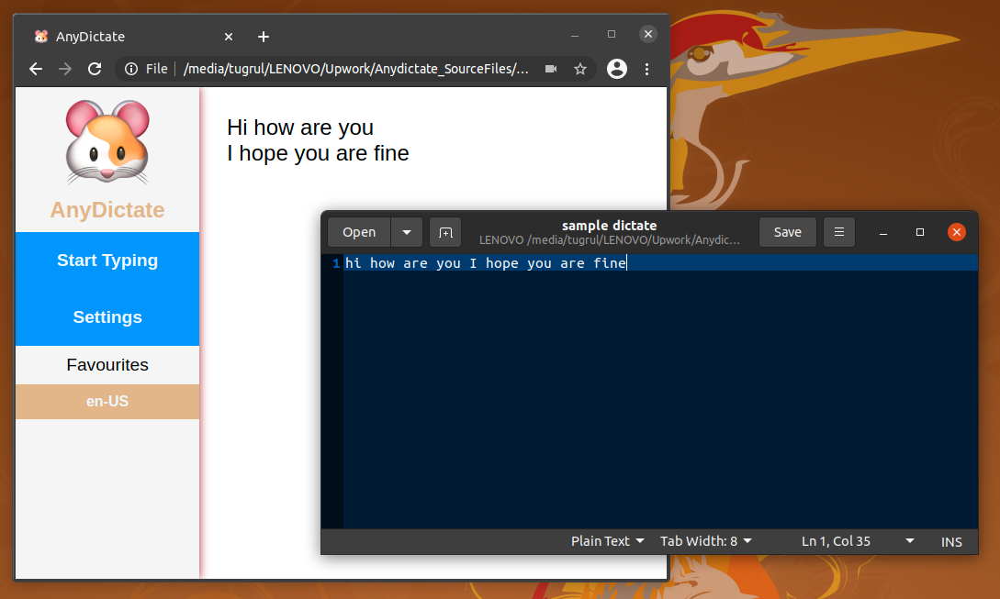

# AnyDictate

This program translates your real-time speech data into text by using Web Speech API, and simulates key presses while you are speaking, so you can write in any text editor simply with your voice.

## Example image

